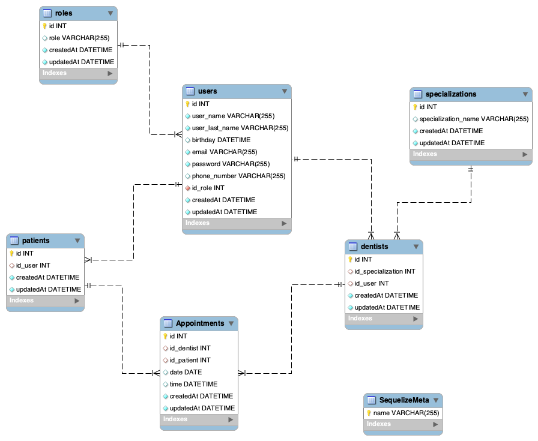

# Aplicación Backend API para gestión de una Clinica Dental

<details>
  <summary>Contenido 📝</summary>
  <ol>
    <li><a href="#objetivo">Objetivo</a></li>
    <li><a href="#sobre-el-proyecto">Sobre el proyecto</a></li>
    <li><a href="#deploy-🚀">Deploy</a></li>
    <li><a href="#stack">Stack</a></li>
    <li><a href="#diagrama-bd">Diagrama</a></li>
    <li><a href="#instalación-en-local">Instalación</a></li>
    <li><a href="#endpoints">Endpoints</a></li>
    <li><a href="#futuras-funcionalidades">Futuras funcionalidades</a></li>
    <li><a href="#contacto">Contacto</a></li>
  </ol>
</details>

## Objetivo

Este proyecto requería una API funcional conectada a una base de datos creando endpoints para la obtención de datos.

## Sobre el proyecto

Aplicación API de ejemplo para la gestión de una base de datos de una clinica dental. La gestión se realiza teniendo en cuenta los distintos tipos de roles (admin, dentist y patient), la autenticación está basada en token.

## Deploy 🚀

<div align="center">
    <a href="https://backend-clinicadental-production.up.railway.app"><strong>Url a producción </strong></a>🚀🚀🚀
</div>

## Stack

Tecnologías utilizadas:

<div align="center">
<a href="https://sequelize.org/">
    
</a>
<a href="https://www.expressjs.com/">
    
</a>
<a href="https://nodejs.org/es/">
    
</a>
<a href="https://developer.mozilla.org/es/docs/Web/JavaScript">
    
</a>
 </div>

## Diagrama BD



## Instalación en local

1. Clonar el repositorio
2. `$ npm install`
3. Conectamos nuestro repositorio con la base de datos
4. `$ Ejecutamos las migraciones`
5. `$ Ejecutamos los seeders`
6. `$ npm run dev`

## Endpoints

<details>
<summary>Endpoints</summary>

- AUTH

  - Registrar usuario

        POST http://localhost:3000/auth/register

    body:

    ```js
        {
        "user_name": "Steven",
        "user_last_name": "Garzon",
        "birthday": "1996-08-02",
        "email": "steven@garzon.com",
        "password": "12345678",
        "phone_number": "+34 678763802"
        }
    ```

  - Login

        POST http://localhost:3000/auth/login

    body:

    ```js
        {
            "email": "steven@garzon.com",
            "password": "12345678"
        }
    ```

- ADMIN

  - Obtener todos los usuarios

        GET http://localhost:3000/admin/all-users?page=1

  - Obtener usuario por id

        GET http://localhost:3000/admin/user/:id

  - Obtener todos los pacientes

        GET http://localhost:3000/admin/all-patients?page=1

  - Obtener todos los dentistas

        GET http://localhost:3000/admin/all-dentists?page=1

  - Actualizar usuario por id

        PUT http://localhost:3000/admin/update-user/:id

    body:

    ```js
        {
            "email": "steven@serna.com"
        }
    ```

- DENTIST

  - Obtener todos los pacientes

        GET http://localhost:3000/api/dentist/all-patients?page=1

  - Obtener la lista de mis citas

        GET http://localhost:3000/api/dentist/my-appointments?page=1

  - Obtener borrar alguna cita existente por id de la cita

        DELETE http://localhost:3000/api/dentist/delete-appointment

    body:

    ```js
        {
            "id": 3
        }
    ```

- PATIENT

  - Obtener mi perfil

        GET http://localhost:3000/api/users/profile

  - Actualizar mi perfil

        PUT http://localhost:3000/api/users/update-profile

    body:

    ```js
        {
            "birthday": "1999-09-14"
        }
    ```

  - Crear una cita escogiendo el dentista

        POST http://localhost:3000/api/users/new-appointment

    body:

    ```js
        {
            // 1. john smith (Orthodontics)
            // 2. jane doe (Periodontics)
            // 3. alex wilson (Endodontics)
            // 4. sarah jones (Maxillofacial)
            // 5. michael brown (Prosthodontics)

            {
                "id_dentist": 2,
                "date": "2023-11-11",
                "time": "18:30:00"
            }
        }
    ```

- Obtener todas mis citas

       GET http://localhost:3000/api/users/my-appointments?page=1

 </details>

## Futuras funcionalidades

⬜ Futuros end points para la obtención detalla de la cita.</br>
⬜ Crear validaciones de roles conjuntas.</br>
⬜ vista completa de la citas, nombre del paciente, nombre del dentista.</br>

## Contacto

<a href="https://es.linkedin.com/in/mario-steeven-garz%C3%B3n-serna-27405a194" target="_blank"></a>

<a href="https://github.com/Stevengs7" target="_blank"></a>
